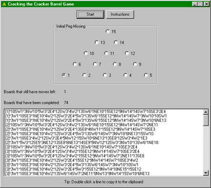



## Cracking the Cracker Barrel Game

### Description

Ever been to the restaurant Cracker Barrel and tried to win at that triangle game with the golf pegs? This program will solve the game when given any of the 15 pegs as a starting point. It creates a solution by trying every single possible combination of moves. Once the program has run, it will add all the possible combinations to a listbox, and sort each entry by the number of pegs that will remain -- the goal is to win by having only one peg remain. Entries starting with [1] mean that only one peg remains. After the brackets for each entry, the program explains how to get to a specific situation -- for instance, if it says 1W3, the peg in hole 1 should jump over peg 2 and end up in peg 3. Each jump is separated by an asterisk. For more information and a complete explanation, please visit http://www.celtickane.com/programming/code/cracker.php

Also, I would absolutely appreciate comments and votes.
 
### More Info
 
This code uses a brute-force method of finding the best solution for the problem. It uses dynamic arrays and a basic algorithm to find all the possible outcomes for the game.

             |
---                |---
**Submitted On**   |2005-06-27 19:09:14
**By**             |[Sean Patrick Kane](https://github.com/Planet-Source-Code/PSCIndex/blob/master/ByAuthor/sean-patrick-kane.md)
**Level**          |Intermediate
**User Rating**    |5.0 (15 globes from 3 users)
**Compatibility**  |VB 4\.0 \(32\-bit\), VB 5\.0, VB 6\.0
**Category**       |[Math/ Dates](https://github.com/Planet-Source-Code/PSCIndex/blob/master/ByCategory/math-dates__1-37.md)
**World**          |[Visual Basic](https://github.com/Planet-Source-Code/PSCIndex/blob/master/ByWorld/visual-basic.md)
**Archive File**   |[Cracking\_t1906116272005\.zip](https://github.com/Planet-Source-Code/sean-patrick-kane-cracking-the-cracker-barrel-game__1-61360/archive/master.zip)

